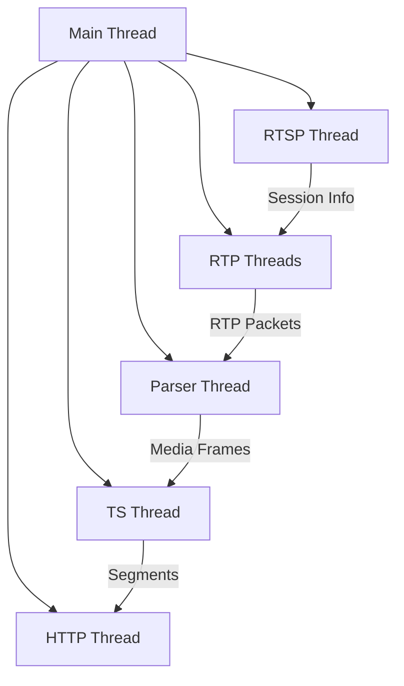

# zvdk Architecture

## Overview

zvdk is a library for RTSP to HLS conversion written in Zig 0.13, focusing on high performance, memory efficiency, and minimal external dependencies. It handles RTSP streaming, media parsing (H.264/H.265/AAC), TS segment creation, and HLS serving.

## Core Components

### 1. RTSP Client
- **Purpose**: Connect to RTSP servers and manage media session
- **Key Features**:
  - TCP-based command/response handling (DESCRIBE, SETUP, PLAY)
  - SDP parsing for media stream information
  - UDP-based RTP packet reception
  - Session state management
- **Implementation Details**:
  ```zig
  const RtspClient = struct {
      allocator: std.mem.Allocator,
      tcp_conn: std.net.TcpStream,
      udp_sockets: []UdpSocket, // One per media stream
      session_id: ?[]const u8,
      cseq: u32,
      
      pub fn init(allocator: std.mem.Allocator) !RtspClient;
      pub fn connect(url: []const u8) !void;
      pub fn describe() !SdpInfo;
      pub fn setup(track: *Track) !void;
      pub fn play() !void;
      pub fn teardown() !void;
  };
  ```

### 2. Media Processing
- **Purpose**: Parse RTP packets into codec frames
- **Components**:
  1. RTP Packet Handler
     - Parse RTP headers
     - Handle packet reordering
     - Manage sequence numbers
  2. Codec Parsers
     - H.264/H.265: NAL unit extraction
     - AAC: ADTS frame reconstruction
- **Implementation Details**:
  ```zig
  const MediaParser = struct {
      codec_type: CodecType,
      ring_buffer: RingBuffer,
      
      pub fn parseRtpPacket(packet: *RtpPacket) !MediaFrame;
      pub fn extractNalUnit(data: []const u8) !NalUnit;
  };
  ```

### 3. Transport Stream Handling
- **Purpose**: Create TS segments from media frames
- **Components**:
  1. PES Packetizer
     - Frame to PES conversion
     - PTS/DTS timing
  2. TS Muxer
     - PES to TS packet conversion
     - Stream multiplexing
     - PCR insertion
- **Implementation Details**:
  ```zig
  const TsEncoder = struct {
      video_pid: u16,
      audio_pid: u16,
      continuity_counters: std.AutoHashMap(u16, u8),
      
      pub fn createPesPacket(frame: *MediaFrame) !PesPacket;
      pub fn createTsPacket(pes: *PesPacket) !TsPacket;
      pub fn muxStreams(video: []TsPacket, audio: []TsPacket) !void;
  };
  ```

### 4. HLS Components
- **Purpose**: Manage segments and serve HLS content
- **Components**:
  1. Segmenter
     - Buffer TS packets
     - Create segment files
     - Manage segment lifecycle
  2. Playlist Generator
     - Create/update m3u8 playlists
     - Handle sliding window
  3. HTTP Server
     - Serve segments and playlists
     - Handle client requests
- **Implementation Details**:
  ```zig
  const HlsServer = struct {
      segments: std.ArrayList(Segment),
      http_server: HttpServer,
      segment_duration: u32,
      
      pub fn addSegment(segment: *Segment) !void;
      pub fn updatePlaylist() !void;
      pub fn serveHls(port: u16) !void;
  };
  ```

## Threading Model

### Thread Structure
1. **Main Thread**
   - Configuration and initialization
   - Thread coordination
   - Shutdown handling

2. **RTSP Thread**
   - RTSP command handling
   - TCP connection management
   - Session state updates

3. **RTP Thread(s)**
   - One per media stream (video/audio)
   - UDP packet reception
   - Basic reordering

4. **Parser Thread**
   - Media frame extraction
   - Codec-specific parsing
   - Frame queueing

5. **TS/Segment Thread**
   - TS packet creation
   - Segment file writing
   - Playlist updates

6. **HTTP Server Thread**
   - Handle HLS client connections
   - Serve segments and playlists

### Inter-Thread Communication


## Memory Management

### 1. Buffer Design
- Ring buffers for stream data
- Pre-allocated packet pools
- Zero-copy operations where possible

### 2. Memory Optimization
```zig
const RingBuffer = struct {
    buffer: []u8,
    read_pos: usize,
    write_pos: usize,
    capacity: usize,
    
    pub fn write(data: []const u8) !usize;
    pub fn read(data: []u8) !usize;
};
```

### 3. Resource Lifecycle
- Clear ownership rules per component
- Explicit cleanup in deinit functions
- Automatic resource cleanup with defer

## Error Handling

### 1. Error Types
```zig
const ZvdkError = error{
    RtspConnectionFailed,
    SdpParseError,
    RtpPacketError,
    MediaParseError,
    TsEncodingError,
    SegmentationError,
    HlsServerError,
};
```

### 2. Error Propagation
- Use Zig's error unions
- Clear error contexts
- Proper cleanup on errors

## Testing Strategy

### 1. Unit Tests
- Per-component testing
- Mock interfaces for dependencies
- Clear test scenarios

### 2. Integration Tests
- End-to-end flow testing
- Real network testing
- Performance benchmarks

### 3. Test Coverage
- 100% line coverage target
- Edge case testing
- Fuzz testing for parsers

## Performance Considerations

### 1. Critical Paths
1. RTP packet reception and parsing
2. Media frame extraction
3. TS packet creation and writing

### 2. Optimizations
- Minimize allocations in hot paths
- Use preallocated buffers
- Efficient thread synchronization

### 3. Monitoring Points
- Packet drop rates
- Processing latency
- Memory usage

## Configuration

### 1. Runtime Options
```zig
const Config = struct {
    segment_duration_ms: u32 = 10000, // 10 seconds
    max_segments: u32 = 6,
    port: u16 = 8080,
    thread_pool_size: u8 = 4,
};
```

### 2. Compile-Time Options
- Debug logging
- Performance tracing
- Buffer sizes

## Usage Example

```zig
const zvdk = @import("zvdk");

pub fn main() !void {
    var gpa = std.heap.GeneralPurposeAllocator(.{}){};
    defer _ = gpa.deinit();
    
    var client = try zvdk.RtspClient.init(gpa.allocator());
    defer client.deinit();
    
    try client.connect("rtsp://example.com/stream");
    try client.play();
    
    var hls = try zvdk.HlsServer.init(gpa.allocator());
    defer hls.deinit();
    
    try hls.start();
    
    while (true) {
        try client.processStream();
    }
}
```

## Dependencies
- Zig Standard Library (std)
  - std.net for networking
  - std.Thread for concurrency
  - std.fs for file operations
- No external dependencies

## Future Considerations

### 1. Potential Enhancements
- HTTPS support for HLS
- Additional codec support
- Adaptive bitrate streaming

### 2. Scalability
- Multiple stream handling
- Clustering support
- Resource limiting

## References
1. RTSP RFC 2326
2. RTP RFC 3550
3. H.264 RTP Payload Format RFC 6184
4. HTTP Live Streaming RFC 8216
